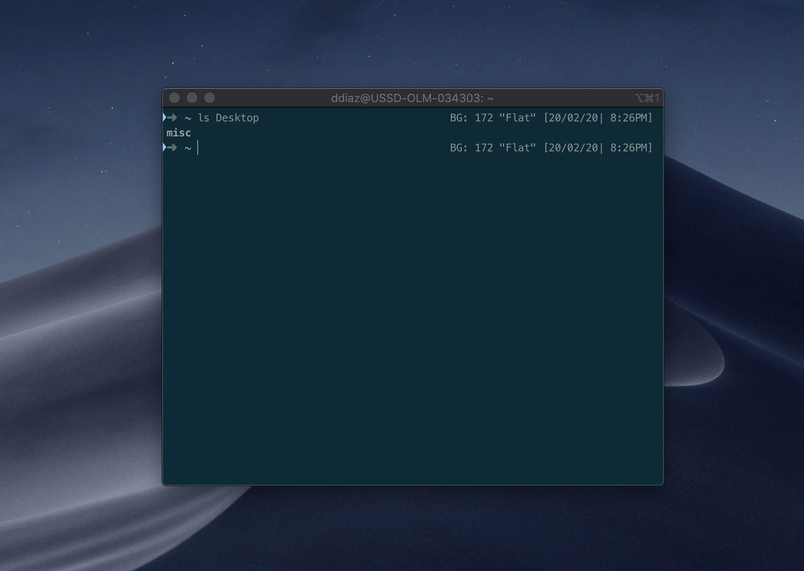

# Nightscout Terminal



## Goal 
Display blood glucose in terminal (specifically iterm2) without impeding performance.

#### Background
You can set up iterm to display custom commands in your status bar, so in effect you can have it curl your nightscout endpoint for your current bg. 
But this round trip on every call slows downs your terminal expierence.
SO the idea here is to have a cron job, or in this case, systemd job that runs every minute, and writes your current glucose to a file.
Now, all you need to do is cat that file, which is waaaaay faster than a curl.

## Prereqs
Nightscout Website

## How To Install
#### Deploy Cron Job
Open up a shell
Export two variables:
```bash
export base_url='https://<your-url>.herokuapp.com'
export script_dest='<your-path>/nightscoutcron.sh'
```
Run the deploy script
```bash
sh ./deploy.sh
```
Verify its working as expected
```bash
cat ~/glucose.txt
```

#### Set up your shell to display the Blood Glucose info
Add the following line to your .zshrc file, make sure to reload it afterwards
```bash
RPROMPT='$( echo "BG: " )$( cat ~/glucose.txt ) [%D{%m/%f/%y}|%@]'
```
Basically, all we are doing is catting the glucose file, which gives us access to the most recent data, without having to do a curl call!

#### Obviously shout out to the people at NightScout for making all this possible...
We are not waiting

#### Note this project is not officially endorsed by Nightscout in any way.

# Useful Links
https://alvinalexander.com/mac-os-x/mac-osx-startup-crontab-launchd-jobs